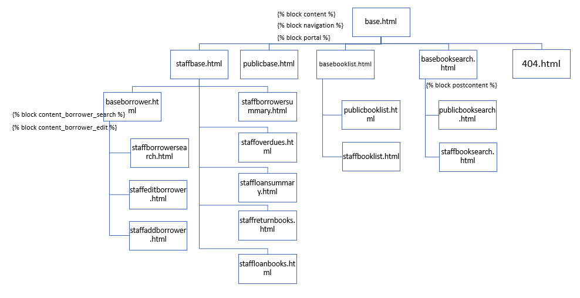

# COMP636 S1 2023 Library Web App 

This project is created for COMP636 Summer School 2022 Web Application Final Assessment.

## Introduction
The web-based library management system is a platform for managing books and members for multiple library branches. The system is built using Python, Flask, Bootstrap CSS, and MySQL. The project was initiated to improve the efficiency of library operations, reduce manual work, and provide a convenient way for members to access information about books and their loans.

## Contact

- Author: Li Gao
- Student ID: 1155084
- Email: Li.Gao@lincolnuni.ac.nz

## Getting Started

Instructions on how to install and set up the project on a local machine for development and testing purposes.

### Prerequisites

Code management - Code is stored in different locations
1. Local machine: where the code development mainly happens
2. GitHub Repo: where the code is mainly stored and distributed
3. Pythonanywhere: production envrionment, code stored there is stable; DB connection file is different from GitHub

### Installation

Steps:
0. Navigate to folder 636S12023_WebApp

1. Create virtual environment using the following commands
        py -3 -m venv .venv
        .venv\\Scripts\\activate or navigate to .venv folder and run Scripts\\activate
2. Install the packages
        navigate to the main folder 636S12023_WebApp, and run the following command
        pip install -r requirements.txt

3. Use the virtualenv as python interpreter (otherwise not able to pick up the packages installed inside this virtualenv)

4. Navigate to folder librarywebapp (where app.py is located), and run the following commands
        flask run
        Webapp running on http://127.0.0.1:5000

## Project Report (Part 1): 

This project report consists of two sections. The first section focuses on discussing the structure of the web application's routes and functions, as well as the underlying assumptions and design choices made. The second section delves into the proposed changes and feasibility for supporting multiple library branches.

### Structure of Routes and Functions 

The web application consists of multiple routes that handle different operations such as adding books, members, and branches, managing book loans, and displaying relevant information to the users. The templates are linked to the routes, and the necessary data is passed between them using Flask.

The main routes are:

1. Homepage: This is the landing page of the system and provides links to other pages such as books, members, loans and other related summaries. There are two portals: staff portal and public portal. Staff can navigate between staff portal and public portal; while public users can only see public portal.

2. Books: The group of pages display the list of books available in the library and search books to find out which books are available, whether they are on loan or not (and if they are, when they are due back).

3. Members: The group of pages display the list of members and provide options to add new members and modify existing ones.

4. Loans: The group of pages display the list of books that are checked out by members and provide options to check out and return books.

5. Summary: There are 3 summary pages, which are overdue summary, loan summary and borrower summary.

how your routes and templates relate to each other and what data is being passed between them, do not just give a list of your routes.

Page Template Hiarachy:

### Assumptions and Design Decisions

For example, did you share a page template between public and staff or use two separate pages? Did you detect GET or POST method to determine what page displays? If so, how and why? Note these types of decisions and assumptions as you work.

Assumptions:

1. Physical copies: Hardcover, Paperback, Illustrated; Digital copies (eBooks, Audio Books).
2. Users cannot add a loan for a non-digital copy when another borrower still has that copy (I cannot borrow a particular paperback when another borrower still has it at her house).
3. Users can add a loan for a digital copy any time (regardless of whether it is marked as returned or not returned)
4. All loans have a due date, and can be 'returned', regardless of copy format.

The system assumes that each branch has a unique name and address.
The books are identified by their ISBN number, which is assumed to be unique for each book.
Members are identified by their library card number, which is assumed to be unique for each member.
The system is designed to provide a basic level of functionality and can be enhanced in the future based on the needs of the library.

The system assumes that only one branch of the library can be selected at a time and all operations will be performed based on the selected branch.
The design decision was made to include a branch management page to allow the administrator to add and manage the branches.
The system is designed to display only the books and members that are related to the selected branch.
The book loan related table stores the name of the branch where the book is checked out to track the book's location.

The web-based library management system for multiple library branches is a platform that provides a convenient and efficient way for managing books and members for multiple branches. The system is designed to be user-friendly, and the templates are linked to the routes to ensure that the relevant information is displayed to the users. The system can be further enhanced in the future to meet the changing needs of the library.

## Project Report (Part 2): 

Changes and Feasibility to Support Multiple Library Branches

### Changes to database tables (new tables and modifications to existing tables) 

1. Library Branch Information Table: This table will store the information of all branches of the library, such as branch name, address, phone number, etc.

2. Book Information Table: This table will store the information of all books available in the library, such as book title, author, ISBN number, publication date, etc.

3. Member Information Table: This table will store the information of all members who have registered with the library, such as member name, address, phone number, etc.

4. Book Inventory Table: This table will store the information about the availability of books in each branch, such as book title, branch name, availability status, etc.

Add a new table for library branches, which will store the branch name, address, and other related information.
Modify the book inventory table to include the branch name column to track which branch has a particular book.
Add a new column in the book loan related table to store the branch name where the book is checked out.

### Changes to the web application

1. Branch Selection: A new feature will be added to the web app to allow the users to select the branch from which they want to borrow a book. The app will fetch the data from the "Book Inventory Table" to display the availability of books in the selected branch.

2. Book Request: Members can request books from different branches. The request will be forwarded to the selected branch, and the branch will then update the availability status in the "Book Inventory Table".

3. Book Transfer: A new feature will be added to the app to allow the transfer of books between branches. The app will fetch the data from the "Book Inventory Table" to display the availability of books in different branches.

4. Branch Report: A new report will be added to the app to display the book inventory of each branch. The report will show the total number of books available, total number of books borrowed, and the total number of books requested in each branch.

5. Member Report: A new report will be added to the app to display the borrowing history of each member. The report will show the books borrowed by the member, the date of borrowing, and the date of return.

Add a new page to add and manage library branches.
Modify the existing pages to display and manage books based on the selected branch.
Implement the functionality to transfer books between branches.

## Error Encountered

1. Virtual envrionment cannot be activated
Error messages: Scripts\Activate.ps1 cannot be loaded because running scripts is disabled on this system. For more information, see about_Execution_Policies at https:/go.microsoft.com/fwlink/?LinkID=135170.
Solution: 
https://www.sharepointdiary.com/2014/03/fix-for-powershell-script-cannot-be-loaded-because-running-scripts-is-disabled-on-this-system.html

Questions:
When we are searching the catalogue and returning the loan information, it is possible for each of digital copies having mutiple loan records (given the they can be borrowed while on loan). Should we display all the loan records for digital copies or just the most recent one?