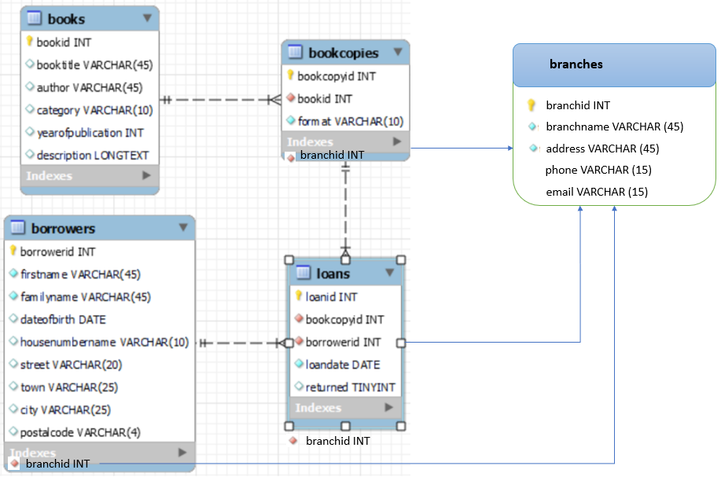

# COMP636 S1 2023 Library Web App

This project is created for COMP636 Summer School 2022 Web Application Final Assessment.

## Introduction
The web-based library management system is a platform for managing books and members for multiple library branches. The system is built using Python, Flask, Bootstrap CSS, and MySQL. This project is created for a small community library and has only two interfaces:

1. The first, not requiring any identifying information to be entered, should allow borrowers to search the catalogue to find out which books are available, if they are on loan or not (and if they are when they are due back)
2. The second interface is focused on library staff, allowing them to issue books to borrowers and return books that have been on loan. The project was designed to be simple enough for any user to understand how it works without any training. Some functionality is repeated on different pages for a user convenience.

---

## Contact

- Author: Li Gao
- Student ID: 1155084
- Email: Li.Gao@lincolnuni.ac.nz

---

## Demo Sites

- Public access - http://ligao2022.pythonanywhere.com/
- Staff access - http://ligao2022.pythonanywhere.com/staff

---

## Getting Started

Instructions on how to install and set up the project on a local machine for development and testing purposes.

### Prerequisites

Code management - Code is stored in different locations
1. Local machine: where the code development mainly happens
2. GitHub Repo: where the code is mainly stored and distributed
3. Pythonanywhere: production envrionment, code stored there is stable; DB connection file is different from GitHub

### Installation

Steps:

1. Navigate to folder 636S12023_WebApp

2. Create virtual environment using the following commands
        py -3 -m venv .venv
        .venv\\Scripts\\activate or navigate to .venv folder and run Scripts\\activate
3. Install the packages
        navigate to the main folder 636S12023_WebApp, and run the following command
        pip install -r requirements.txt

4. Use the virtualenv as python interpreter (otherwise not able to pick up the packages installed inside this virtualenv)

5. Navigate to folder librarywebapp (where app.py is located), and run the following commands
        flask run
        Webapp running on http://127.0.0.1:5000

---

## Error Encountered

1. Virtual envrionment cannot be activated
Error messages: Scripts\Activate.ps1 cannot be loaded because running scripts is disabled on this system. For more information, see about_Execution_Policies at https:/go.microsoft.com/fwlink/?LinkID=135170.
Solution: 
https://www.sharepointdiary.com/2014/03/fix-for-powershell-script-cannot-be-loaded-because-running-scripts-is-disabled-on-this-system.html

---

## Project Report (Part 1) - Structure, Assumption and Design: 

This project report consists of two sections. The first section focuses on discussing the structure of the web application's routes and functions, as well as the underlying assumptions and design choices made. The second section delves into the proposed changes and feasibility for supporting multiple library branches.

### Structure of Routes and Functions 

The web application consists of multiple routes that handle different operations such as adding books, members, and branches, managing book loans, and displaying relevant information to the users. The templates are linked to the routes, and the necessary data is passed between them using Flask.

The main routes are:

1. Homepage: This is the landing page of the system and provides links to other pages such as books, members, loans and other related summaries. 
There are two portals:
   - staff portal (Staff can navigate between staff portal and public portal; Staff menu is displayed including menber/loan/report pages)
   - public portal (Public users can only see public portal; only public menu is displayed like book search)

        Data passed between those two home pages mainly depend on parameters `navigation` and `portal`.

2. Books: The group of pages display the list of books available in the library and search book copies to find out which books are available, whether they are on loan or not (and if they are, when they are due back).
There are two main pages:
   - `basebooklist.html` (public/ staff)

        Data passed between those two book list pages depend on parameters `navigation` and `portal`.

   - `basebooksearch.html` (public/ staff)
        
        Data passed between those two book list pages depend on parameters `postcontent`.

3. Members: The group of pages display the list of members and provide options to add new members and modify existing ones.
There are two main pages both inherit `baseborrower.html`:
   - `staffborrowersearch.html`
   - `staffeditborrower.html`

        Data passed between those two book list pages depend on parameters `content_borrower_search` and `content_borrower_edit`.

4. Loans: The group of pages display the list of books that are checked out by members and provide options to check out and return books.
There are two main pages both inherit `staffbase.html`:
   - `staffreturnbooks.html`
   - `staffloanbooks.html`
        Data passed between those two book list pages depend on parameters `books` and `loanedbooks`.

5. Summary: There are 3 summary pages, which are overdue summary, loan summary and borrower summary. All of them inherit `staffbase.html`.
   - `staffoverdues.html`
   - `staffborrowersummary.html`
   - `staffloansummary.html`

Please refer to the following page template hiarachy:

### Assumptions and Design Decisions

#### I followed assumptions and requirements below:

1. The books are identified by their book copy id, which is assumed to be unique for each book. 
2. Physical copies: Hardcover, Paperback, Illustrated; Digital copies: eBooks, Audio Books.
3. Users cannot add a loan for a non-digital copy when another borrower still has that copy.
4. Members are identified by their library card number (borrower id), which is assumed to be unique for each member.
5. Users can add a loan for a digital copy any time (regardless of whether it is marked as returned or not returned).
6. All loans have a due date, and can be 'returned', regardless of copy format.
7. Non-admin users won’t be accessing “/staff” page and admin/staff know how to access this page.

#### I made design decisions below:

1. Page templates are shared and used between public and staff. For instance, `publicbooksearch.html` and `staffbooksearch.html` share the same template `basebooksearch.html`. Because those pages are basically the same and the navigation panel is the only difference, it increases reusability of code using a template. Similar decisions have been made in borrower search and edit pages, etc. 
2. If a page might both GET or POST method, I use the same page to display both actions. Examples like book search page `publicbooksearch.html` and member search page `staffborrowersearch.html`. This is because even with different GET or POST method, they are basically displaying the same content with not much difference. GET method retrives all records in the database, while the POST method does a search and retrives the matched records in the database.

---

## Project Report (Part 2) - Changes and Feasibility to Support Multiple Library Branches: 

The library web app was initially designed to provide a basic level of functionality and can be enhanced in the future based on the needs of the library. The second section of the project report will discuss the proposed changes and feasibility for supporting multiple library branches based on the current implementation.

### Assumptions
   - The system assumes that each branch has a unique name and address.
   - The system assumes that only one branch of the library can be selected at a time and all operations will be performed based on the selected branch.

### Design decisions
   - The design decision was made to include a branch management page to allow the administrator to add and manage the branches.
   - The system is designed to display only the books and members that are related to the selected branch.

### Changes to database tables (new tables and modifications to existing tables) 

1. Library Branch Information Table (*New*): This table will store the information of all branches of the library, such as branch name, address, phone number, etc. The primary key is `branchid`, which will be the foreign keys in other related tables.

2. Book Information Table `library.books` (*No change*): This table will store the information of all books available in the library, such as book title, author, publication date, etc.

3. Member Information Table `library.borrowers` (*Modified*): This table will store the information of all members who have registered with the library, such as member name, address, phone number, etc.
    - Changes: Modify the menber information table to include the `branchid` column to track which branch is the primary branch for each member.

4. Book Inventory Table `library.bookcopies` (*Modified*): This table will store the information about the availability of books in each branch, such as book title, branch name, availability status, etc. 
    - Changes: Modify the book inventory table to include the `branchid` column to track which branch has a particular book.

4. Book Loan Table `library.loans` (*Modified*): This table will store the information about the availability of books in each branch, such as book title, branch name, availability status, etc.
    - Changes: Modify the book loan table to include the `branchid` column where the book is checked out to track the book's location.

Refer to the following page for the proposed database structure:

### Changes to the web application

1. Branch Management: Add a new page for staffs or admin users to add and manage library branches.

2. Branch Selection: Modify the existing pages to display and manage books based on the selected branch. A new feature will be added to the web app to allow the users to select the branch from which they want to borrow a book. The app will fetch the data from the "Book Inventory Table" to display the availability of books in the selected branch.

3. Book Request: Members can request books from different branches. The request will be forwarded to the selected branch, and the branch will then update the availability status in the "Book Inventory Table".

4. Book Transfer: A new feature will be added to the app to allow the transfer of books between branches. The app will fetch the data from the "Book Inventory Table" to display the availability of books in different branches.

5. Branch Report: A new report will be added to the app to display the book inventory of each branch. The report will show the total number of books available, total number of books borrowed, and the total number of books requested in each branch.